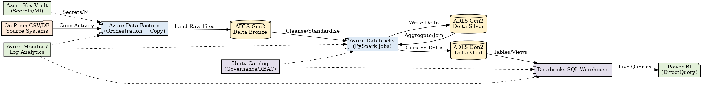
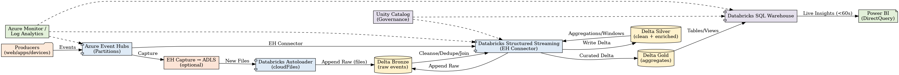

# Azure Medallion Architecture – Batch & Streaming (ADF • Databricks • Event Hubs • Delta • Power BI)

This repository contains a **production-style implementation** of the Medallion Architecture (Bronze → Silver → Gold) on **Microsoft Azure** for **both batch and streaming** data pipelines.

## 📌 Architecture

**Batch (ADF → ADLS Gen2 Bronze → Databricks → Silver/Gold → Power BI)**  


**Streaming (Event Hubs → Databricks Structured Streaming/Autoloader → Silver/Gold → Power BI)**  


**Combined View**  


## 🧱 Components
- **Azure Data Factory** – Orchestration of batch ingestion to ADLS Gen2 (Bronze).
- **Azure Databricks (PySpark)** – Transformations to build Delta **Silver/Gold**; Structured Streaming for real time.
- **Azure Event Hubs** – Real-time ingestion for product reviews/events.
- **Delta Lake** – ACID, schema enforcement/evolution, time travel.
- **Power BI (DirectQuery)** – Live analytics on Gold via Databricks SQL Warehouse.
- **Unity Catalog** – Optional governance/RBAC.
- **Azure Monitor / Log Analytics** – Observability.

## ⚙️ Workflows

### Batch
1. **Ingest (ADF)** raw sales/product/inventory → **ADLS Gen2 Bronze**
2. **Transform (Databricks)** cleanse/standardize → **Silver**
3. **Aggregate (Databricks)** star-schema/curated marts → **Gold**
4. **Serve (Databricks SQL + Power BI)** DirectQuery models

### Streaming
1. **Ingest (Event Hubs)** product reviews/events
2. **Process (Databricks Structured Streaming + Autoloader)** with sentiment logic
3. **Persist (Delta)** Bronze → Silver → Gold
4. **Serve (Power BI)** sub-minute dashboards

## 📁 Repository Structure
```
azure-medallion-pipeline/
├─ batch/
│  ├─ notebooks/
│  │  ├─ bronze_ingestion.py
│  │  ├─ silver_transformations.py
│  │  └─ gold_aggregations.py
│  └─ adf_pipelines/
│     └─ pipeline_bronze.json   # Export your ADF pipeline ARM here
├─ streaming/
│  ├─ notebooks/
│  │  ├─ eventhubs_ingestion.py
│  │  └─ sentiment_analysis.py
│  └─ config/
│     └─ eventhubs_config_example.json
├─ resources/
│  ├─ azure_batch_pipeline_v2.png
│  ├─ azure_streaming_pipeline_v2.png
│  └─ azure_combined_medallion_v2.png
├─ .github/workflows/ci.yml
├─ .gitignore
├─ LICENSE
└─ README.md
```

## 🚀 Getting Started
1. **Create Azure resources:** ADLS Gen2, Databricks workspace, ADF, Event Hubs.
2. **Secrets:** Use **Azure Key Vault** / Databricks secrets. Do **not** commit credentials.
3. **ADF:** Export your pipeline ARM JSON into `batch/adf_pipelines/` (Manage → ARM template).
4. **Databricks notebooks:** Export as `.py` and place under `batch/notebooks/` and `streaming/notebooks/`.
5. **Configure streaming:** Copy `streaming/config/eventhubs_config_example.json` → `eventhubs_config.json` (not committed).
6. **Power BI:** Connect to Databricks SQL Warehouse (DirectQuery). Add screenshots to `resources/` if desired.

## 📈 Performance & Impact (example targets)
- Batch: reduced reporting latency to **< 1 hour**.
- Streaming: **< 60 seconds** E2E latency; scalable to **thousands of events/sec**.
- Cost: **~30% savings** via autoscaling, OPTIMIZE, partition pruning.

## 🛡️ Security & Governance
- Managed Identity + OAuth for storage.
- Secrets in Key Vault (no keys in code).
- Unity Catalog for RBAC and lineage; Purview optional.

## 🔧 CI (optional)
GitHub Action runs lint checks on notebooks/py files and validates JSON.

---

> **Note:** Replace placeholder notebooks and ADF JSON with your actual code. Never commit secrets.
